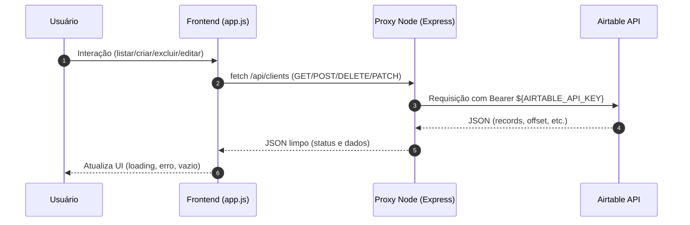

# Cadastro de Clientes (Frontend + Airtable via Proxy)

Aplicação simples de cadastro de clientes com CRUD (Create, Read, Delete e PATCH como bônus), utilizando frontend em HTML/CSS/JS puro e um proxy Node/Express para esconder o token da API do Airtable.

## Requisitos

- Node 18+
- Uma Base no Airtable com a tabela `Clientes` e campos: `nome` (Single line text), `email` (Email) e `telefone` (Single line text)

## Variáveis de Ambiente

Crie um arquivo `.env` baseado em `.env.example`:

```
PORT=3000
AIRTABLE_API_KEY=seu_token_airtable
AIRTABLE_BASE_ID=appXXXXXXXXXXXXXX
AIRTABLE_TABLE_NAME=Clientes
```

> Nunca comite o token. O `.gitignore` já ignora `.env`.

## Como rodar

1. Instale as dependências:
   ```bash
   npm install
   ```
2. Inicie o servidor:
   ```bash
   npm run dev
   ```
3. Acesse `http://localhost:3000`.

## O que está incluído

- `index.html`: estrutura, formulário e tabela de clientes
- `style.css`: estilos simples e responsivos
- `app.js`: chamadas `GET/POST/DELETE/PATCH` para o proxy e estados de UI
- `server.js`: proxy seguro para Airtable (usa `dotenv`) e estáticos
- `.env.example`: exemplo de variáveis necessárias (copie para `.env`)

## Endpoints do Proxy

- `GET /api/clients?search=&pageSize=&offset=`: lista clientes (com busca e paginação do Airtable)
- `POST /api/clients`: cria um cliente `{ nome, email, telefone }`
- `DELETE /api/clients/:id`: remove um cliente
- `PATCH /api/clients/:id`: edita campos (bônus)

## Diagrama de sequência



## Notas de segurança

- O token do Airtable nunca aparece no frontend; fica no `.env` do servidor.
- Para deploy, configure as variáveis em Secrets do provedor (Railway, Render, Replit, etc.).

## Dicas

- A busca usa `filterByFormula` simples (LOWER + FIND). Ajuste conforme sua base.
- A paginação usa `pageSize` e `offset` do Airtable.


